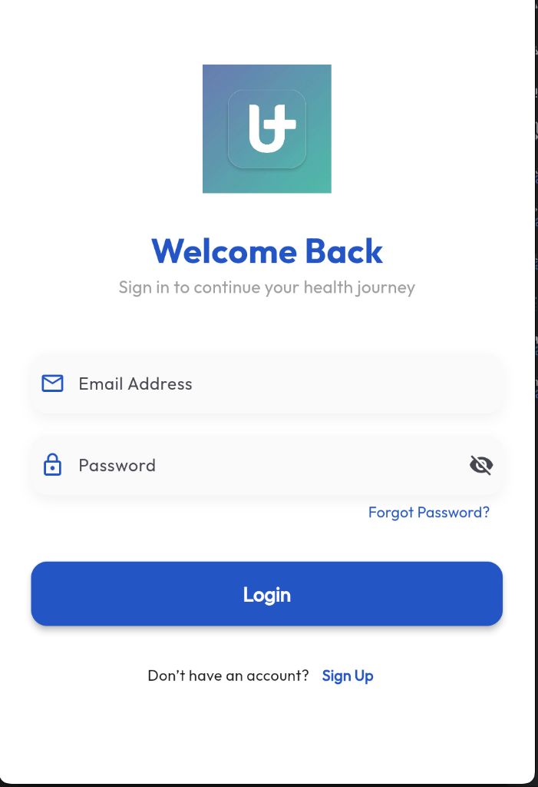
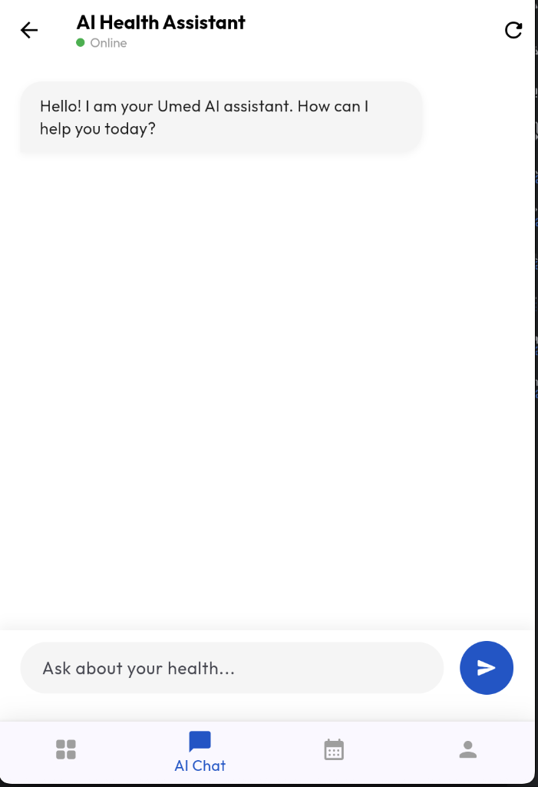
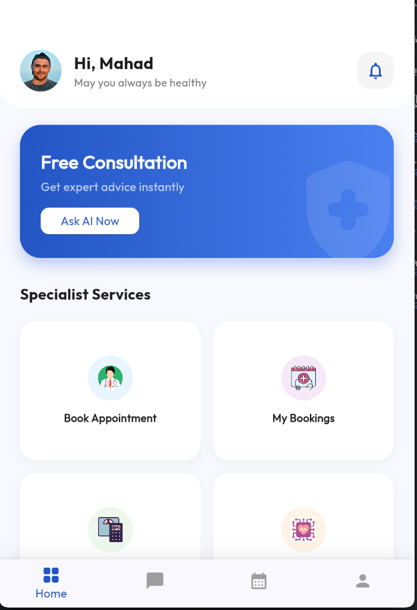
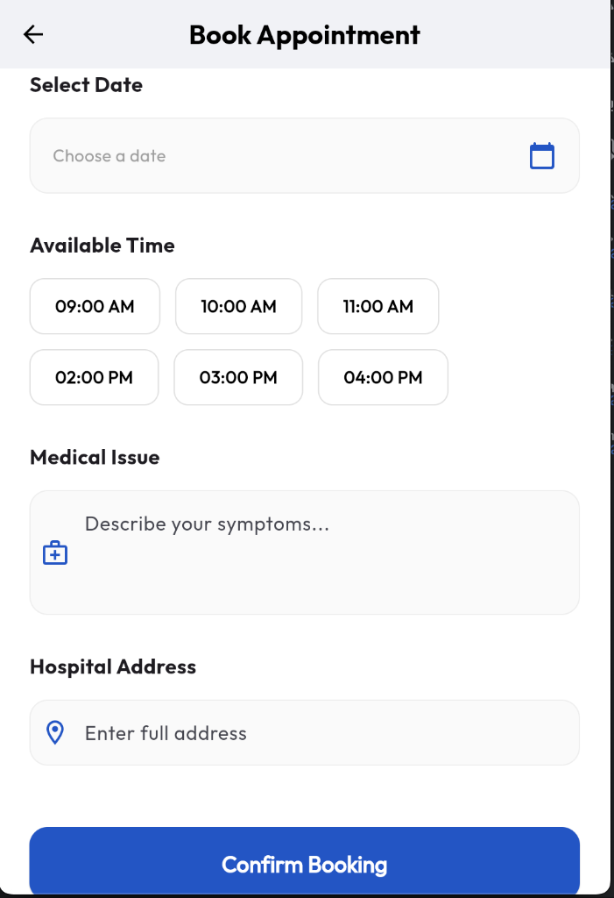

# Umed (Project Medify) 🩺

**Umed** is a comprehensive, AI-driven healthcare companion designed to modernize the patient experience. Originally developed as a native Android app, this repository now hosts the high-performance **Flutter** migration, providing a unified medical platform for both Mobile and Web.

## 🚀 Key Features

### 📸 AI Medical Report Scanner
Tired of medical jargon? Umed uses **Google ML Kit (OCR)** and **GPT-4o** to scan physical medical reports and translate complex values into simple, understandable insights for patients.

### 💬 24/7 AI Health Chatbot
A virtual assistant powered by Large Language Models to answer health-related queries, check symptoms, and provide instant medical guidance anytime, anywhere.

### 📅 Smart Appointment Management
Integrated booking system for seamless scheduling with specialized healthcare professionals.

### ⚖️ Health Tools & Resources
- **BMI Calculator:** Track your health metrics instantly.
- **Article Hub:** Curated medical articles to promote preventative care.

---

## 📸 Screenshots

| Login & Dashboard | AI Chat & Appointments | BMI Calculator |
| :---: | :---: | :---: |
|  <br> **Login** |  <br> **AI Assistant** |  <br> **BMI Tracker** |
|  <br> **Home Screen** |  <br> **Booking** | |

---

## 🛠 Technical Stack

- **Frontend:** [Flutter](https://flutter.dev/) (3.x)
- **Backend:** [Firebase Realtime Database](https://firebase.google.com/products/realtime-database) (Region: Europe-West1)
- **Authentication:** [Firebase Auth](https://firebase.google.com/products/auth)
- **AI/ML Engine:**
  - [Google ML Kit](https://developers.google.com/ml-kit) (On-device OCR)
  - OpenAI **GPT-4o** (via AIML API)
- **Design:** Modern "Glassmorphism" UI with [Lottie](https://lottiefiles.com/) animations.

---

## 📂 Project Structure

- `umed_flutter/`: The modern Flutter migration (Mobile & Web).
- `android_native/`: The legacy Kotlin implementation for historical reference.

---

## 🔧 Getting Started

### Prerequisites
- Flutter SDK installed.
- Firebase project configured with a Realtime Database.

### Installation
1. Clone the repository:
   ```bash
   git clone https://github.com/marwanesb/Umed.git
   ```
2. Navigate to the Flutter directory:
   ```bash
   cd umed_flutter
   ```
3. Get dependencies:
   ```bash
   flutter pub get
   ```
4. Run the app:
   ```bash
   flutter run
   ```

---

## 👨‍💻 Author
**Marwane Sabir**

*"Bridging medical technology and human understanding."*
